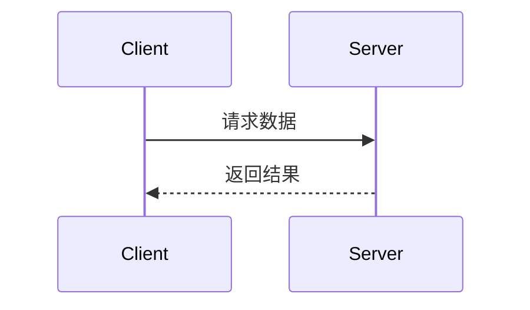

# 心理咨询系统接口文档（精简版）

仅保留当前项目实际使用的接口，按业务分组。所有需要登录的接口请在请求头携带 Authorization: Bearer <token>。

## 通用
- 响应格式（ApiResponse/Result）：
  {
    "error": 0,
    "body": {},
    "message": "ok",
    "success": true
  }
- 上传：表单字段名均为 file。

## 认证
- 用户注册：POST /api/auth/register
- 用户登录：POST /api/auth/login
- 咨询师注册：POST /api/auth/doctor/register

## 学生端（/api/user）
- 获取个人信息：GET /api/user/profile
- 更新个人信息：PUT /api/user/profile
- 修改密码：PUT /api/user/password
- 医生列表：GET /api/user/doctors
- 搜索医生：GET /api/user/doctors/search?keyword=xxx
- 医生详情：GET /api/user/doctors/{id}
- 医生排班：GET /api/user/doctors/{doctorId}/schedule?weekOffset=0
- 创建预约：POST /api/user/appointments
- 我的预约列表：GET /api/user/appointments
- 取消预约：PUT /api/user/appointments/{id}/cancel
- 创建/获取聊天会话：POST /api/user/chat/sessions
- 学生会话列表：GET /api/user/chat/sessions
- 会话消息：GET /api/user/chat/sessions/{sessionId}/messages
- 学生发送消息：POST /api/user/chat/send

## 咨询师端（/api/doctor）
- 获取个人信息：GET /api/doctor/profile
- 更新个人信息：PUT /api/doctor/profile
- 今日统计：GET /api/doctor/stats/today
- 今日预约：GET /api/doctor/appointments/today
- 预约列表：GET /api/doctor/appointments?status=&page=1&pageSize=10
- 确认预约：PUT /api/doctor/appointments/{id}/confirm
- 拒绝预约：PUT /api/doctor/appointments/{id}/reject
- 完成预约：PUT /api/doctor/appointments/{id}/complete
- 待回复消息：GET /api/doctor/messages/pending
- 会话列表：GET /api/doctor/chat/sessions
- 会话消息：GET /api/doctor/chat/sessions/{session_id}/messages
- 发送消息：POST /api/doctor/chat/send
- 获取排班：GET /api/doctor/schedules?weekOffset=0
- 更新排班：PUT /api/doctor/schedules

## 心理测评（/api/assessment）
- 量表列表：GET /api/assessment/scales
- 量表详情（含题目）：GET /api/assessment/scales/{scaleId}
- 量表题目列表：GET /api/assessment/scales/{scaleId}/questions
- 提交测评：POST /api/assessment/submit
- 测评记录列表：GET /api/assessment/records
- 测评结果详情：GET /api/assessment/results/{recordId}
- 测评统计：GET /api/assessment/stats

## AI 助手对话（/api/chat）
- 创建会话：POST /api/chat/sessions
- 会话列表：GET /api/chat/sessions
- 会话消息：GET /api/chat/sessions/{sessionId}/messages
- 发送消息：POST /api/chat/send
- 删除会话：DELETE /api/chat/sessions/{sessionId}

## 文件上传（/api/file）
- 上传头像：POST /api/file/avatar（需登录，按角色分目录存储）
- 上传通用文件：POST /api/file/upload## 📖 API文档规范

### 文档同步要求
**当生成或修改API接口时，以下内容变更必须同步更新API文档：**
- 入参结构变更
- 返回参数变更  
- URL地址变更
- 请求方式变更

### 文档格式标准

#### 基本信息
```markdown
## 接口名称

**接口名称：** 简短描述接口功能
**功能描述：** 详细描述接口的业务用途
**接口地址：** /api/endpoint
**请求方式：** GET/POST
```

#### 功能说明
```markdown
### 功能说明
详细描述接口的业务逻辑，可以使用流程图或时序图：



#### 请求参数
```markdown
### 请求参数
```json
{
  "page": 1,
  "page_size": 10,
  "status": "active"
}
```

| 参数名 | 类型 | 必填 | 说明 | 示例值 |
|-------|------|-----|------|--------|
| page | int | 否 | 页码（默认1） | 2 |
| page_size | int | 否 | 每页数量（默认10） | 20 |
| status | string | 否 | 状态过滤 | active |
```

#### 响应参数
```markdown
### 响应参数
```json
{
  "error": 0,
  "body": {
    "user_id": 1,
    "username": "admin",
    "email": "admin@example.com",
    "status": "active"
  },
  "message": "获取用户基本信息成功",
  "success": true
}
```

| 参数名 | 类型 | 必填 | 说明 | 示例值 |
|-------|------|-----|------|--------|
| error | int | 是 | 错误码 | 0 |
| body | object | 是 | 响应数据 | |
| body.user_id | int | 是 | 用户ID | 1 |
| body.username | string | 是 | 用户名 | admin |
| body.email | string | 是 | 邮箱 | admin@example.com |
| body.status | string | 是 | 用户状态 | active |
| message | string | 是 | 响应消息 | 获取用户基本信息成功 |
| success | bool | 是 | 是否成功 | true |
```

**注意：** 如果body是对象，需要列出所有子字段，格式为 `body.字段名`

---

## 获取用户个人信息

**接口名称：** 获取用户个人信息
**功能描述：** 用于在首页、个人中心等页面展示用户的基本信息（头像、姓名、学院等）
**接口地址：** /api/user/profile
**请求方式：** GET

### 功能说明
获取当前登录用户的详细信息。

### 请求参数
无

### 响应参数
```json
{
  "error": 0,
  "body": {
    "id": 1001,
    "name": "张同学",
    "avatar": "https://images.unsplash.com/photo-1535713875002-d1d0cf377fde",
    "college": "计算机科学与技术学院",
    "major_class": "软件工程 1班",
    "student_id": "2023001001",
    "phone": "138****8888",
    "email": "zhang@example.com",
    "stats": {
        "counseling_hours": 12.5,
        "appointments_count": 3,
        "checkin_streak": 5
    }
  },
  "message": "获取成功",
  "success": true
}
```

| 参数名 | 类型 | 必填 | 说明 | 示例值 |
|-------|------|-----|------|--------|
| error | int | 是 | 错误码 | 0 |
| body | object | 是 | 用户数据 | |
| body.id | int | 是 | 用户ID | 1001 |
| body.name | string | 是 | 姓名 | 张同学 |
| body.avatar | string | 是 | 头像URL | ... |
| body.college | string | 是 | 学院 | 计算机学院 |
| body.stats | object | 是 | 统计数据 | |
| success | bool | 是 | 是否成功 | true |

## 提交心情签到

**接口名称：** 提交心情签到
**功能描述：** 用户在首页点击心情图标进行每日签到
**接口地址：** /api/mood/checkin
**请求方式：** POST

### 请求参数
```json
{
  "mood": "happy"
}
```

| 参数名 | 类型 | 必填 | 说明 | 示例值 |
|-------|------|-----|------|--------|
| mood | string | 是 | 心情类型 (happy, normal, sad, angry) | happy |

### 响应参数
```json
{
  "error": 0,
  "body": {
    "streak": 6
  },
  "message": "签到成功",
  "success": true
}
```

## 获取咨询师列表

**接口名称：** 获取咨询师列表
**功能描述：** 获取可预约的心理咨询师列表，支持搜索和筛选
**接口地址：** /api/doctors
**请求方式：** GET

### 请求参数
```json
{
  "page": 1,
  "keyword": "李",
  "tag": "anxiety",
  "sort": "rating"
}
```

| 参数名 | 类型 | 必填 | 说明 | 示例值 |
|-------|------|-----|------|--------|
| page | int | 否 | 页码 | 1 |
| keyword | string | 否 | 搜索关键词 | 李 |
| tag | string | 否 | 擅长领域标签 | anxiety |
| sort | string | 否 | 排序方式 | rating |

### 响应参数
```json
{
  "error": 0,
  "body": {
    "list": [
        {
            "id": 1,
            "name": "李华 医生",
            "title": "注册心理师",
            "avatar": "...",
            "rating": 4.9,
            "tags": ["焦虑抑郁", "个人成长"],
            "next_available": "2025-12-19 14:00"
        }
    ],
    "total": 20
  },
  "success": true
}
```

## 提交预约申请

**接口名称：** 提交预约申请
**功能描述：** 用户选择医生和时间段后提交预约
**接口地址：** /api/user/appointments
**请求方式：** POST

### 请求参数
```json
{
  "doctor_id": 1,
  "date": "2025-12-19",
  "time_slot": "14:00",
  "type": "offline"
}
```

| 参数名 | 类型 | 必填 | 说明 | 示例值 |
|-------|------|-----|------|--------|
| doctor_id | int | 是 | 医生ID | 1 |
| date | string | 是 | 预约日期 | 2025-12-19 |
| time_slot | string | 是 | 时间段 | 14:00 |
| type | string | 是 | 咨询方式 (offline, online) | offline |

### 响应参数
```json
{
  "error": 0,
  "body": {
    "appointment_id": 10023,
    "status": "pending"
  },
  "message": "预约申请已提交",
  "success": true
}
```

## 发送 AI 对话消息

**接口名称：** 发送 AI 对话消息
**功能描述：** 用户在 AI 咨询页面发送消息
**接口地址：** /api/chat/send
**请求方式：** POST

### 请求参数
```json
{
  "session_id": "uuid-1234",
  "content": "我最近压力很大",
  "type": "text"
}
```

| 参数名 | 类型 | 必填 | 说明 | 示例值 |
|-------|------|-----|------|--------|
| session_id | string | 是 | 会话ID | uuid-1234 |
| content | string | 是 | 消息内容 | ... |
| type | string | 是 | 消息类型 | text |

### 响应参数
```json
{
  "error": 0,
  "body": {
    "reply": "听起来你正经历着考前焦虑...",
    "risk_level": "low",
    "suggested_actions": []
  },
  "success": true
}
```

## 用户注册

**接口名称：** 用户注册
**功能描述：** 新用户注册账号
**接口地址：** /api/auth/register
**请求方式：** POST

### 请求参数
```json
{
  "username": "张三",
  "studentId": "2023001001",
  "email": "zhangsan@example.com",
  "password": "password123",
  "college": "计算机学院"
}
```

| 参数名 | 类型 | 必填 | 说明 | 示例值 |
|-------|------|-----|------|--------|
| username | string | 是 | 用户名 | 张三 |
| studentId | string | 是 | 学号 | 2023001001 |
| email | string | 是 | 邮箱 | zhangsan@example.com |
| password | string | 是 | 密码 | password123 |
| college | string | 是 | 学院 | 计算机学院 |

### 响应参数
```json
{
  "error": 0,
  "body": {
    "user_id": 1001
  },
  "message": "注册成功",
  "success": true
}
```

## 用户登录

**接口名称：** 用户登录
**功能描述：** 用户登录系统
**接口地址：** /api/auth/login
**请求方式：** POST

### 请求参数
```json
{
  "username": "2023001001",
  "password": "password123"
}
```

| 参数名 | 类型 | 必填 | 说明 | 示例值 |
|-------|------|-----|------|--------|
| username | string | 是 | 用户名或学号 | 2023001001 |
| password | string | 是 | 密码 | password123 |

### 响应参数
```json
{
  "error": 0,
  "body": {
    "token": "eyJhbGciOiJIUzI1NiIsInR5cCI6IkpXVCJ9...",
    "user": {
        "id": 1001,
        "name": "张三",
        "avatar": "..."
    }
  },
  "message": "登录成功",
  "success": true
}
```

---

## 咨询师注册

**接口名称：** 咨询师注册
**功能描述：** 咨询师注册新账号
**接口地址：** /api/auth/doctor/register
**请求方式：** POST

### 请求参数
```json
{
  "name": "李华",
  "title": "注册心理师",
  "phone": "13812345678",
  "password": "password123",
  "email": "lihua@example.com",
  "years": 8,
  "description": "专注于大学生心理健康咨询...",
  "tags": ["焦虑抑郁", "个人成长"],
  "methods": ["认知行为疗法", "人本主义"],
  "certifications": [
    "中国心理学会注册心理师 (X-21-001)",
    "国家二级心理咨询师"
  ]
}
```

| 参数名 | 类型 | 必填 | 说明 | 示例值 |
|-------|------|-----|------|--------|
| name | string | 是 | 咨询师姓名 | 李华 |
| title | string | 是 | 职称 | 注册心理师 |
| phone | string | 是 | 手机号码（用于登录） | 13812345678 |
| password | string | 是 | 密码 | password123 |
| email | string | 是 | 电子邮箱 | lihua@example.com |
| years | int | 是 | 从业年限 | 8 |
| description | string | 否 | 个人简介 | ... |
| tags | array | 否 | 擅长领域标签 | ["焦虑抑郁"] |
| methods | array | 否 | 咨询方法 | ["认知行为疗法"] |
| certifications | array | 否 | 资质认证 | [...] |

### 响应参数
```json
{
  "error": 0,
  "body": {
    "doctorId": 1,
    "name": "李华"
  },
  "message": "注册成功",
  "success": true
}
```

| 参数名 | 类型 | 必填 | 说明 | 示例值 |
|-------|------|-----|------|--------|
| body.doctorId | long | 是 | 咨询师ID | 1 |
| body.name | string | 是 | 咨询师姓名 | 李华 |

---

## 获取咨询师详情

**接口名称：** 获取咨询师详情
**功能描述：** 根据医生ID获取咨询师的完整信息，用于医生详情页展示
**接口地址：** /api/doctors/{id}
**请求方式：** GET

### 请求参数
路径参数：`id` - 咨询师ID

### 响应参数
```json
{
  "error": 0,
  "body": {
    "id": 1,
    "name": "李华 医生",
    "title": "注册心理师",
    "avatar": "https://...",
    "rating": 4.9,
    "years": 8,
    "tags": ["焦虑抑郁", "个人成长"],
    "methods": ["认知行为疗法", "人本主义"],
    "description": "我是李华，专注于大学生心理健康咨询...",
    "certifications": [
      "中国心理学会注册心理师 (X-21-001)",
      "国家二级心理咨询师"
    ],
    "stats": {
      "total_hours": 500,
      "helped_count": 120,
      "positive_rate": 98
    },
    "available": true
  },
  "success": true
}
```

| 参数名 | 类型 | 必填 | 说明 | 示例值 |
|-------|------|-----|------|--------|
| body.id | int | 是 | 咨询师ID | 1 |
| body.name | string | 是 | 姓名 | 李华 医生 |
| body.title | string | 是 | 职称 | 注册心理师 |
| body.rating | float | 是 | 评分 | 4.9 |
| body.years | int | 是 | 从业年限 | 8 |
| body.tags | array | 是 | 擅长领域标签 | ["焦虑抑郁"] |
| body.methods | array | 是 | 咨询方法 | ["认知行为疗法"] |
| body.description | string | 是 | 个人简介 | ... |
| body.certifications | array | 是 | 资质认证列表 | [...] |
| body.stats | object | 是 | 统计数据 | |
| body.available | bool | 是 | 是否可预约 | true |

---

## 获取咨询师可预约时间段

**接口名称：** 获取咨询师可预约时间段
**功能描述：** 获取指定咨询师在未来几天内的可预约时间段
**接口地址：** /api/doctors/{id}/schedules
**请求方式：** GET

### 请求参数
```json
{
  "start_date": "2025-12-18",
  "days": 7
}
```

| 参数名 | 类型 | 必填 | 说明 | 示例值 |
|-------|------|-----|------|--------|
| start_date | string | 否 | 开始日期（默认今天） | 2025-12-18 |
| days | int | 否 | 查询天数（默认7） | 7 |

### 响应参数
```json
{
  "error": 0,
  "body": {
    "schedules": [
      {
        "date": "2025-12-18",
        "weekday": "周四",
        "slots": [
          { "time": "09:00", "available": false },
          { "time": "10:00", "available": false },
          { "time": "14:00", "available": true },
          { "time": "15:00", "available": true },
          { "time": "16:00", "available": true }
        ]
      },
      {
        "date": "2025-12-19",
        "weekday": "周五",
        "slots": [...]
      }
    ]
  },
  "success": true
}
```

---

## 获取 AI 会话历史列表

**接口名称：** 获取 AI 会话历史列表
**功能描述：** 获取当前用户的所有 AI 对话会话记录
**接口地址：** /api/chat/sessions
**请求方式：** GET

### 请求参数
无

### 响应参数
```json
{
  "error": 0,
  "body": {
    "sessions": [
      {
        "session_id": "uuid-1234",
        "title": "考前焦虑缓解",
        "last_message": "最近感觉压力很大，期末考试快到了...",
        "updated_at": "2025-12-18 10:23"
      },
      {
        "session_id": "uuid-5678",
        "title": "人际关系困扰",
        "last_message": "和室友发生了一些小摩擦...",
        "updated_at": "2025-12-17 15:30"
      }
    ]
  },
  "success": true
}
```

---

## 获取指定会话消息记录

**接口名称：** 获取指定会话消息记录
**功能描述：** 根据会话ID获取该会话的完整聊天记录
**接口地址：** /api/chat/sessions/{session_id}/messages
**请求方式：** GET

### 请求参数
路径参数：`session_id` - 会话ID

### 响应参数
```json
{
  "error": 0,
  "body": {
    "messages": [
      {
        "id": 1,
        "role": "assistant",
        "content": "你好！我是你的 AI 心理助手...",
        "created_at": "2025-12-18 10:20"
      },
      {
        "id": 2,
        "role": "user",
        "content": "最近感觉压力很大，期末考试快到了...",
        "created_at": "2025-12-18 10:23"
      },
      {
        "id": 3,
        "role": "assistant",
        "content": "听起来你正经历着考前焦虑...",
        "risk_level": "low",
        "created_at": "2025-12-18 10:23"
      }
    ]
  },
  "success": true
}
```

---

## 创建新 AI 会话

**接口名称：** 创建新 AI 会话
**功能描述：** 创建一个新的 AI 对话会话
**接口地址：** /api/chat/sessions
**请求方式：** POST

### 请求参数
无

### 响应参数
```json
{
  "error": 0,
  "body": {
    "session_id": "uuid-new-9999",
    "title": "新会话"
  },
  "message": "会话创建成功",
  "success": true
}
```

---

## 获取公告列表

**接口名称：** 获取公告列表
**功能描述：** 获取心理咨询中心的公告通知
**接口地址：** /api/announcements
**请求方式：** GET

### 请求参数
```json
{
  "limit": 5
}
```

| 参数名 | 类型 | 必填 | 说明 | 示例值 |
|-------|------|-----|------|--------|
| limit | int | 否 | 获取数量（默认5） | 5 |

### 响应参数
```json
{
  "error": 0,
  "body": {
    "list": [
      {
        "id": 1,
        "title": "关于期末考试期间心理咨询中心延长开放时间的通知",
        "date": "2025-12-15"
      },
      {
        "id": 2,
        "title": ""拥抱阳光"冬季心理健康讲座报名开启",
        "date": "2025-12-10"
      }
    ]
  },
  "success": true
}
```

---

## 获取推荐文章列表

**接口名称：** 获取推荐文章列表
**功能描述：** 获取首页每日精选的推荐阅读文章
**接口地址：** /api/articles
**请求方式：** GET

### 请求参数
```json
{
  "limit": 5
}
```

### 响应参数
```json
{
  "error": 0,
  "body": {
    "list": [
      {
        "id": 1,
        "title": "5分钟呼吸法，有效缓解考前焦虑与紧张",
        "summary": "当你感到压力过大时，尝试这个简单的呼吸练习...",
        "cover": "https://images.unsplash.com/...",
        "tag": "冥想练习",
        "created_at": "5分钟前"
      }
    ]
  },
  "success": true
}
```

---

## 获取我的预约记录

**接口名称：** 获取我的预约记录
**功能描述：** 获取当前用户的咨询预约历史记录
**接口地址：** /api/user/appointments
**请求方式：** GET

### 请求参数
```json
{
  "status": "all",
  "page": 1
}
```

| 参数名 | 类型 | 必填 | 说明 | 示例值 |
|-------|------|-----|------|--------|
| status | string | 否 | 状态过滤 (all/pending/confirmed/completed/cancelled) | all |
| page | int | 否 | 页码 | 1 |

### 响应参数
```json
{
  "error": 0,
  "body": {
    "list": [
      {
        "id": 10023,
        "doctor_id": 1,
        "doctor_name": "李华 医生",
        "doctor_avatar": "...",
        "date": "2025-12-19",
        "time_slot": "14:00",
        "type": "offline",
        "status": "pending",
        "location": "心理健康教育中心 203 室"
      }
    ],
    "total": 3
  },
  "success": true
}
```

---

## 取消预约

**接口名称：** 取消预约
**功能描述：** 用户取消自己的待确认或已确认的预约
**接口地址：** /api/user/appointments/{id}/cancel
**请求方式：** PUT

### 请求参数
| 参数名 | 类型 | 必填 | 说明 | 示例值 |
|-------|------|-----|------|--------|
| id | int | 是 | 预约ID（路径参数） | 10023 |

### 响应参数
```json
{
  "error": 0,
  "body": {
    "id": 10023,
    "status": "cancelled",
    "doctor_name": "李华 医生",
    "date": "2025-12-19",
    "time_slot": "14:00"
  },
  "message": "预约已取消",
  "success": true
}
```

| 参数名 | 类型 | 必填 | 说明 | 示例值 |
|-------|------|-----|------|--------|
| error | int | 是 | 错误码 | 0 |
| body.id | int | 是 | 预约ID | 10023 |
| body.status | string | 是 | 预约状态 | cancelled |
| body.doctor_name | string | 是 | 医生姓名 | 李华 医生 |
| body.date | string | 是 | 预约日期 | 2025-12-19 |
| body.time_slot | string | 是 | 时间段 | 14:00 |
| message | string | 是 | 响应消息 | 预约已取消 |
| success | bool | 是 | 是否成功 | true |

### 业务规则
- 只能取消状态为 `pending`（待确认）或 `confirmed`（已确认）的预约
- 取消后预约状态变为 `cancelled`
- 取消后对应时间段将重新可预约

---

## 学生端聊天接口

### 创建或获取聊天会话

**接口名称：** 创建或获取与咨询师的聊天会话
**功能描述：** 学生点击咨询师的聊天按钮时，创建或获取与该咨询师的聊天会话
**接口地址：** /api/user/chat/sessions
**请求方式：** POST

#### 请求参数
```json
{
  "doctorId": 1
}
```

| 参数名 | 类型 | 必填 | 说明 | 示例值 |
|-------|------|-----|------|--------|
| doctorId | int | 是 | 咨询师ID | 1 |

#### 响应参数
```json
{
  "error": 0,
  "body": {
    "sessionId": "uuid-1234-5678"
  },
  "message": "获取成功",
  "success": true
}
```

---

### 获取聊天会话列表

**接口名称：** 获取学生的聊天会话列表
**功能描述：** 获取当前学生与所有咨询师的聊天会话
**接口地址：** /api/user/chat/sessions
**请求方式：** GET

#### 响应参数
```json
{
  "error": 0,
  "body": [
    {
      "sessionId": "uuid-1234",
      "doctorId": 1,
      "doctorName": "李华医生",
      "doctorAvatar": "...",
      "doctorTitle": "心理咨询师",
      "lastMessage": "您好，有什么可以帮助您的吗？",
      "unreadCount": 2,
      "updatedAt": "2025-12-20 10:30:00"
    }
  ],
  "message": "获取成功",
  "success": true
}
```

---

### 获取会话消息记录

**接口名称：** 获取聊天消息记录
**功能描述：** 获取指定会话的所有消息
**接口地址：** /api/user/chat/sessions/{sessionId}/messages
**请求方式：** GET

#### 请求参数
| 参数名 | 类型 | 必填 | 说明 | 示例值 |
|-------|------|-----|------|--------|
| sessionId | string | 是 | 会话ID（路径参数） | uuid-1234 |

#### 响应参数
```json
{
  "error": 0,
  "body": {
    "doctorId": 1,
    "doctorName": "李华医生",
    "doctorAvatar": "...",
    "doctorTitle": "心理咨询师",
    "messages": [
      {
        "id": 1,
        "role": "student",
        "content": "您好",
        "createdAt": "2025-12-20 10:00:00"
      },
      {
        "id": 2,
        "role": "doctor",
        "content": "您好，有什么可以帮助您的吗？",
        "createdAt": "2025-12-20 10:05:00"
      }
    ]
  },
  "message": "获取成功",
  "success": true
}
```

---

### 学生发送消息

**接口名称：** 学生发送消息
**功能描述：** 学生向咨询师发送消息
**接口地址：** /api/user/chat/send
**请求方式：** POST

#### 请求参数
```json
{
  "sessionId": "uuid-1234",
  "content": "您好，我想咨询一些问题"
}
```

| 参数名 | 类型 | 必填 | 说明 | 示例值 |
|-------|------|-----|------|--------|
| sessionId | string | 是 | 会话ID | uuid-1234 |
| content | string | 是 | 消息内容 | 您好 |

#### 响应参数
```json
{
  "error": 0,
  "body": {
    "id": 123,
    "role": "student",
    "content": "您好，我想咨询一些问题",
    "createdAt": "2025-12-20 10:30:00"
  },
  "message": "发送成功",
  "success": true
}
```

---

## 获取咨询师评价列表

**接口名称：** 获取咨询师评价列表
**功能描述：** 获取指定咨询师的学生评价
**接口地址：** /api/doctors/{id}/reviews
**请求方式：** GET

### 请求参数
```json
{
  "page": 1
}
```

### 响应参数
```json
{
  "error": 0,
  "body": {
    "list": [
      {
        "id": 1,
        "author": "匿名同学",
        "rating": 5,
        "content": "李老师非常温柔，耐心地听我讲完了所有的事情...",
        "created_at": "2025-12-10"
      }
    ],
    "total": 32
  },
  "success": true
}
```

---

## 更新用户个人信息

**接口名称：** 更新用户个人信息
**功能描述：** 用户修改个人资料信息
**接口地址：** /api/user/profile
**请求方式：** PUT

### 请求参数
```json
{
  "phone": "13812345678",
  "email": "newemail@example.com"
}
```

| 参数名 | 类型 | 必填 | 说明 | 示例值 |
|-------|------|-----|------|--------|
| phone | string | 否 | 手机号码 | 13812345678 |
| email | string | 否 | 电子邮箱 | newemail@example.com |

### 响应参数
```json
{
  "error": 0,
  "body": null,
  "message": "更新成功",
  "success": true
}
```

---

## 修改密码

**接口名称：** 修改密码
**功能描述：** 用户修改登录密码
**接口地址：** /api/user/password
**请求方式：** PUT

### 请求参数
```json
{
  "oldPassword": "原密码",
  "newPassword": "新密码（至少6位）"
}
```

| 参数名 | 类型 | 必填 | 说明 | 示例值 |
|-------|------|-----|------|--------|
| oldPassword | string | 是 | 当前密码 | 123456 |
| newPassword | string | 是 | 新密码（至少6位） | 654321 |

### 响应参数
```json
{
  "error": 0,
  "body": null,
  "message": "密码修改成功",
  "success": true
}
```

### 错误响应
```json
{
  "error": 400,
  "body": null,
  "message": "当前密码错误",
  "success": false
}
```

---

# ========== 咨询师端接口 ==========

## 获取咨询师个人信息

**接口名称：** 获取咨询师个人信息
**功能描述：** 咨询师获取自己的个人资料信息（用于咨询师端展示）
**接口地址：** /api/doctor/profile
**请求方式：** GET

### 请求参数
无（通过 Token 识别当前登录咨询师）

### 响应参数
```json
{
  "error": 0,
  "body": {
    "id": 1,
    "name": "李华",
    "avatar": "https://...",
    "title": "注册心理师",
    "phone": "13812345678",
    "email": "lihua@example.com",
    "description": "我是李华，专注于大学生心理健康咨询...",
    "years": 8,
    "rating": 4.9,
    "tags": ["焦虑抑郁", "个人成长"],
    "methods": ["认知行为疗法", "人本主义"],
    "certifications": [
      "中国心理学会注册心理师 (X-21-001)",
      "国家二级心理咨询师"
    ]
  },
  "message": "获取成功",
  "success": true
}
```

| 参数名 | 类型 | 必填 | 说明 | 示例值 |
|-------|------|-----|------|--------|
| body.id | int | 是 | 咨询师ID | 1 |
| body.name | string | 是 | 姓名 | 李华 |
| body.title | string | 是 | 职称 | 注册心理师 |
| body.phone | string | 否 | 联系电话 | 13812345678 |
| body.email | string | 否 | 邮箱 | lihua@example.com |
| body.description | string | 是 | 个人简介 | ... |
| body.years | int | 是 | 从业年限 | 8 |
| body.rating | float | 是 | 评分 | 4.9 |
| body.tags | array | 是 | 擅长领域 | ["焦虑抑郁"] |
| body.methods | array | 是 | 咨询方法 | ["认知行为疗法"] |
| body.certifications | array | 是 | 资质认证 | [...] |

---

## 更新咨询师个人信息

**接口名称：** 更新咨询师个人信息
**功能描述：** 咨询师修改自己的个人资料
**接口地址：** /api/doctor/profile
**请求方式：** PUT

### 请求参数
```json
{
  "name": "李华",
  "title": "注册心理师",
  "phone": "13812345678",
  "email": "lihua@example.com",
  "description": "专注于大学生心理健康咨询...",
  "years": 8,
  "tags": ["焦虑抑郁", "个人成长"],
  "methods": ["认知行为疗法", "人本主义"]
}
```

| 参数名 | 类型 | 必填 | 说明 | 示例值 |
|-------|------|-----|------|--------|
| name | string | 否 | 姓名 | 李华 |
| title | string | 否 | 职称 | 注册心理师 |
| phone | string | 否 | 联系电话 | 13812345678 |
| email | string | 否 | 邮箱 | lihua@example.com |
| description | string | 否 | 个人简介 | ... |
| years | int | 否 | 从业年限 | 8 |
| tags | array | 否 | 擅长领域 | ["焦虑抑郁"] |
| methods | array | 否 | 咨询方法 | ["认知行为疗法"] |

### 响应参数
```json
{
  "error": 0,
  "body": null,
  "message": "更新成功",
  "success": true
}
```

---

## 获取咨询师今日统计

**接口名称：** 获取咨询师今日统计
**功能描述：** 获取咨询师工作台首页的今日统计数据
**接口地址：** /api/doctor/stats/today
**请求方式：** GET

### 请求参数
无

### 响应参数
```json
{
  "error": 0,
  "body": {
    "today_appointments": 5,
    "completed": 2,
    "pending": 3,
    "unread_messages": 8
  },
  "message": "获取成功",
  "success": true
}
```

| 参数名 | 类型 | 必填 | 说明 | 示例值 |
|-------|------|-----|------|--------|
| body.today_appointments | int | 是 | 今日预约数 | 5 |
| body.completed | int | 是 | 已完成数 | 2 |
| body.pending | int | 是 | 待确认数 | 3 |
| body.unread_messages | int | 是 | 未读消息数 | 8 |

---

## 获取咨询师今日预约列表

**接口名称：** 获取咨询师今日预约列表
**功能描述：** 获取咨询师今日的预约记录列表
**接口地址：** /api/doctor/appointments/today
**请求方式：** GET

### 请求参数
无

### 响应参数
```json
{
  "error": 0,
  "body": {
    "list": [
      {
        "id": 10023,
        "student_id": 1001,
        "student_name": "张同学",
        "student_avatar": "https://...",
        "time_slot": "14:00",
        "type": "offline",
        "status": "confirmed",
        "description": "最近压力较大，希望咨询"
      }
    ]
  },
  "message": "获取成功",
  "success": true
}
```

| 参数名 | 类型 | 必填 | 说明 | 示例值 |
|-------|------|-----|------|--------|
| body.list[].id | int | 是 | 预约ID | 10023 |
| body.list[].student_id | int | 是 | 学生ID | 1001 |
| body.list[].student_name | string | 是 | 学生姓名 | 张同学 |
| body.list[].student_avatar | string | 是 | 学生头像 | https://... |
| body.list[].time_slot | string | 是 | 时间段 | 14:00 |
| body.list[].type | string | 是 | 咨询方式 | offline |
| body.list[].status | string | 是 | 状态 | confirmed |

---

## 获取咨询师预约列表（分页）

**接口名称：** 获取咨询师预约列表（分页）
**功能描述：** 获取咨询师的所有预约记录，支持筛选和分页
**接口地址：** /api/doctor/appointments
**请求方式：** GET

### 请求参数
```json
{
  "status": "all",
  "date": "2025-12-18",
  "keyword": "张",
  "page": 1
}
```

| 参数名 | 类型 | 必填 | 说明 | 示例值 |
|-------|------|-----|------|--------|
| status | string | 否 | 状态过滤 (all/pending/confirmed/completed/rejected/cancelled) | all |
| date | string | 否 | 日期过滤 | 2025-12-18 |
| keyword | string | 否 | 搜索关键词（学生姓名/学号） | 张 |
| page | int | 否 | 页码 | 1 |

### 响应参数
```json
{
  "error": 0,
  "body": {
    "list": [
      {
        "id": 10023,
        "student_id": 1001,
        "student_name": "张同学",
        "student_id_no": "2023001001",
        "student_avatar": "https://...",
        "date": "2025-12-19",
        "time_slot": "14:00",
        "type": "offline",
        "status": "pending",
        "description": "最近压力较大，希望咨询",
        "created_at": "2025-12-17 10:30"
      }
    ],
    "total": 25,
    "page": 1,
    "page_size": 10
  },
  "message": "获取成功",
  "success": true
}
```

---

## 确认预约

**接口名称：** 确认预约
**功能描述：** 咨询师确认一个待处理的预约
**接口地址：** /api/doctor/appointments/{id}/confirm
**请求方式：** PUT

### 请求参数
路径参数：`id` - 预约ID

### 响应参数
```json
{
  "error": 0,
  "body": null,
  "message": "预约已确认",
  "success": true
}
```

---

## 拒绝预约

**接口名称：** 拒绝预约
**功能描述：** 咨询师拒绝一个待处理的预约
**接口地址：** /api/doctor/appointments/{id}/reject
**请求方式：** PUT

### 请求参数
```json
{
  "reason": "该时段已有其他安排"
}
```

| 参数名 | 类型 | 必填 | 说明 | 示例值 |
|-------|------|-----|------|--------|
| reason | string | 否 | 拒绝原因 | 该时段已有其他安排 |

### 响应参数
```json
{
  "error": 0,
  "body": null,
  "message": "预约已拒绝",
  "success": true
}
```

---

## 完成预约

**接口名称：** 完成预约
**功能描述：** 咨询师标记一个预约为已完成
**接口地址：** /api/doctor/appointments/{id}/complete
**请求方式：** PUT

### 请求参数
```json
{
  "notes": "本次咨询主要讨论了学业压力问题，学生情绪有所改善"
}
```

| 参数名 | 类型 | 必填 | 说明 | 示例值 |
|-------|------|-----|------|--------|
| notes | string | 否 | 咨询记录备注 | ... |

### 响应参数
```json
{
  "error": 0,
  "body": null,
  "message": "预约已完成",
  "success": true
}
```

---

## 获取待回复消息列表

**接口名称：** 获取待回复消息列表
**功能描述：** 获取咨询师未回复的学生消息列表
**接口地址：** /api/doctor/messages/pending
**请求方式：** GET

### 请求参数
无

### 响应参数
```json
{
  "error": 0,
  "body": {
    "list": [
      {
        "session_id": "uuid-1234",
        "student_id": 1001,
        "student_name": "张同学",
        "student_avatar": "https://...",
        "last_message": "老师您好，我想咨询一下...",
        "unread_count": 3,
        "updated_at": "2025-12-18 10:30"
      }
    ]
  },
  "message": "获取成功",
  "success": true
}
```

---

## 获取咨询师聊天会话列表

**接口名称：** 获取咨询师聊天会话列表
**功能描述：** 获取咨询师与学生的所有聊天会话
**接口地址：** /api/doctor/chat/sessions
**请求方式：** GET

### 请求参数
无

### 响应参数
```json
{
  "error": 0,
  "body": {
    "sessions": [
      {
        "session_id": "uuid-1234",
        "student_id": 1001,
        "student_name": "张同学",
        "student_avatar": "https://...",
        "last_message": "好的，谢谢老师",
        "unread_count": 0,
        "updated_at": "2025-12-18 10:30"
      }
    ]
  },
  "message": "获取成功",
  "success": true
}
```

---

## 获取咨询师会话消息记录

**接口名称：** 获取咨询师会话消息记录
**功能描述：** 获取咨询师与某个学生的聊天记录
**接口地址：** /api/doctor/chat/sessions/{session_id}/messages
**请求方式：** GET

### 请求参数
路径参数：`session_id` - 会话ID

### 响应参数
```json
{
  "error": 0,
  "body": {
    "student": {
      "id": 1001,
      "name": "张同学",
      "avatar": "https://...",
      "college": "计算机学院"
    },
    "messages": [
      {
        "id": 1,
        "role": "student",
        "content": "老师您好，我想咨询一下...",
        "created_at": "2025-12-18 10:20"
      },
      {
        "id": 2,
        "role": "doctor",
        "content": "你好，有什么可以帮助你的吗？",
        "created_at": "2025-12-18 10:25"
      }
    ]
  },
  "message": "获取成功",
  "success": true
}
```

---

## 咨询师发送消息

**接口名称：** 咨询师发送消息
**功能描述：** 咨询师向学生发送聊天消息
**接口地址：** /api/doctor/chat/send
**请求方式：** POST

### 请求参数
```json
{
  "session_id": "uuid-1234",
  "content": "你好，有什么可以帮助你的吗？"
}
```

| 参数名 | 类型 | 必填 | 说明 | 示例值 |
|-------|------|-----|------|--------|
| session_id | string | 是 | 会话ID | uuid-1234 |
| content | string | 是 | 消息内容 | ... |

### 响应参数
```json
{
  "error": 0,
  "body": {
    "message_id": 123
  },
  "message": "发送成功",
  "success": true
}
```

---

## 获取咨询师排班

**接口名称：** 获取咨询师排班
**功能描述：** 获取咨询师的排班/可预约时间设置
**接口地址：** /api/doctor/schedules
**请求方式：** GET

### 请求参数
```json
{
  "week_offset": 0
}
```

| 参数名 | 类型 | 必填 | 说明 | 示例值 |
|-------|------|-----|------|--------|
| week_offset | int | 否 | 周偏移量（0=本周，1=下周，-1=上周） | 0 |

### 响应参数
```json
{
  "error": 0,
  "body": {
    "week_start": "2025-12-16",
    "week_end": "2025-12-22",
    "schedules": {
      "2025-12-16": {
        "09:00": { "available": true, "booked": false },
        "10:00": { "available": true, "booked": true },
        "11:00": { "available": false, "booked": false },
        "14:00": { "available": true, "booked": false },
        "15:00": { "available": true, "booked": false },
        "16:00": { "available": true, "booked": false },
        "17:00": { "available": false, "booked": false }
      },
      "2025-12-17": { ... },
      ...
    }
  },
  "message": "获取成功",
  "success": true
}
```

| 参数名 | 类型 | 必填 | 说明 | 示例值 |
|-------|------|-----|------|--------|
| body.week_start | string | 是 | 本周开始日期 | 2025-12-16 |
| body.week_end | string | 是 | 本周结束日期 | 2025-12-22 |
| body.schedules | object | 是 | 排班数据（按日期-时间段） | {...} |
| schedules[date][time].available | bool | 是 | 是否可预约 | true |
| schedules[date][time].booked | bool | 是 | 是否已被预约 | false |

---

## 更新咨询师排班

**接口名称：** 更新咨询师排班
**功能描述：** 咨询师更新自己的排班/可预约时间
**接口地址：** /api/doctor/schedules
**请求方式：** PUT

### 请求参数
```json
{
  "schedules": {
    "2025-12-16": {
      "09:00": true,
      "10:00": true,
      "11:00": false,
      "14:00": true,
      "15:00": true,
      "16:00": true,
      "17:00": false
    },
    "2025-12-17": { ... }
  }
}
```

| 参数名 | 类型 | 必填 | 说明 | 示例值 |
|-------|------|-----|------|--------|
| schedules | object | 是 | 排班数据（日期-时间段-是否可预约） | {...} |

### 响应参数
```json
{
  "error": 0,
  "body": null,
  "message": "排班更新成功",
  "success": true
}

---

# 心理测评模块

## 获取测评量表列表

**接口名称：** 获取测评量表列表
**功能描述：** 获取所有可用的心理测评量表列表
**接口地址：** /api/assessment/scales
**请求方式：** GET

### 请求参数
无

### 响应参数
```json
{
  "error": 0,
  "body": [
    {
      "id": 1,
      "name": "SCL-90症状自评量表",
      "description": "SCL-90症状自评量表是当前使用最为广泛的精神障碍和心理疾病门诊检查量表",
      "category": "综合评估",
      "questionCount": 50,
      "estimatedTime": 15,
      "instructions": "请根据最近一周的感受选择最符合的选项"
    }
  ],
  "message": "获取成功",
  "success": true
}
```

| 参数名 | 类型 | 必填 | 说明 | 示例值 |
|-------|------|-----|------|--------|
| body | array | 是 | 量表列表 | |
| body[].id | int | 是 | 量表ID | 1 |
| body[].name | string | 是 | 量表名称 | SCL-90 |
| body[].description | string | 是 | 量表描述 | ... |
| body[].category | string | 是 | 分类 | 综合评估 |
| body[].questionCount | int | 是 | 题目数量 | 50 |
| body[].estimatedTime | int | 是 | 预计时间（分钟） | 15 |

---

## 获取量表详情

**接口名称：** 获取量表详情
**功能描述：** 获取指定量表的详细信息及所有题目
**接口地址：** /api/assessment/scales/{scaleId}
**请求方式：** GET

### 请求参数
| 参数名 | 类型 | 必填 | 说明 | 示例值 |
|-------|------|-----|------|--------|
| scaleId | long | 是 | 量表ID（路径参数） | 1 |

---

## 获取量表题目

**接口名称：** 获取量表题目
**功能描述：** 仅获取指定量表的题目列表
**接口地址：** /api/assessment/scales/{scaleId}/questions
**请求方式：** GET

---

## 提交测评答案

**接口名称：** 提交测评答案
**功能描述：** 提交用户的测评答案，系统计算得分并返回结果
**接口地址：** /api/assessment/submit
**请求方式：** POST

### 请求参数
```json
{
  "scaleId": 1,
  "answers": [
    {"questionId": 1, "answerValue": 2},
    {"questionId": 2, "answerValue": 1}
  ],
  "duration": 600
}
```

| 参数名 | 类型 | 必填 | 说明 | 示例值 |
|-------|------|-----|------|--------|
| scaleId | long | 是 | 量表ID | 1 |
| answers | array | 是 | 答案列表 | |
| answers[].questionId | long | 是 | 题目ID | 1 |
| answers[].answerValue | int | 是 | 选择的答案值 | 2 |
| duration | int | 否 | 答题用时（秒） | 600 |

---

## 获取用户测评记录

**接口名称：** 获取用户测评记录
**功能描述：** 获取当前用户的历史测评记录列表
**接口地址：** /api/assessment/records
**请求方式：** GET

---

## 获取测评结果详情

**接口名称：** 获取测评结果详情
**功能描述：** 获取指定测评记录的详细结果
**接口地址：** /api/assessment/results/{recordId}
**请求方式：** GET

---

## 获取用户测评统计

**接口名称：** 获取用户测评统计

---

# ========== 文件上传接口 ==========

## 上传头像

**接口名称：** 上传头像
**功能描述：** 用户或咨询师上传头像图片
**接口地址：** /api/file/avatar
**请求方式：** POST
**Content-Type:** multipart/form-data

### 请求参数

| 参数名 | 类型 | 必填 | 说明 | 示例值 |
|-------|------|-----|------|--------|
| file | file | 是 | 头像图片文件（支持JPG/PNG/GIF/WEBP，最大5MB） | - |

### 响应参数
```json
{
  "error": 0,
  "body": {
    "url": "/uploads/avatars/avatar_student_1_1703145600000.jpg"
  },
  "message": "上传成功",
  "success": true
}
```

| 参数名 | 类型 | 必填 | 说明 | 示例值 |
|-------|------|-----|------|--------|
| body.url | string | 是 | 头像访问URL | /uploads/avatars/xxx.jpg |

### 错误响应
```json
{
  "error": 400,
  "body": null,
  "message": "只支持 JPG、PNG、GIF、WEBP 格式的图片",
  "success": false
}
```

---

## 上传通用文件

**接口名称：** 上传通用文件
**功能描述：** 上传通用文件
**接口地址：** /api/file/upload
**请求方式：** POST
**Content-Type:** multipart/form-data

### 请求参数

| 参数名 | 类型 | 必填 | 说明 | 示例值 |
|-------|------|-----|------|--------|
| file | file | 是 | 要上传的文件 | - |
| type | string | 否 | 文件类型分类（默认common） | images |

### 响应参数
```json
{
  "error": 0,
  "body": {
    "url": "/uploads/images/abc123.jpg"
  },
  "message": "上传成功",
  "success": true
}
```
**功能描述：** 获取当前用户的测评统计数据
**接口地址：** /api/assessment/stats
**请求方式：** GET
